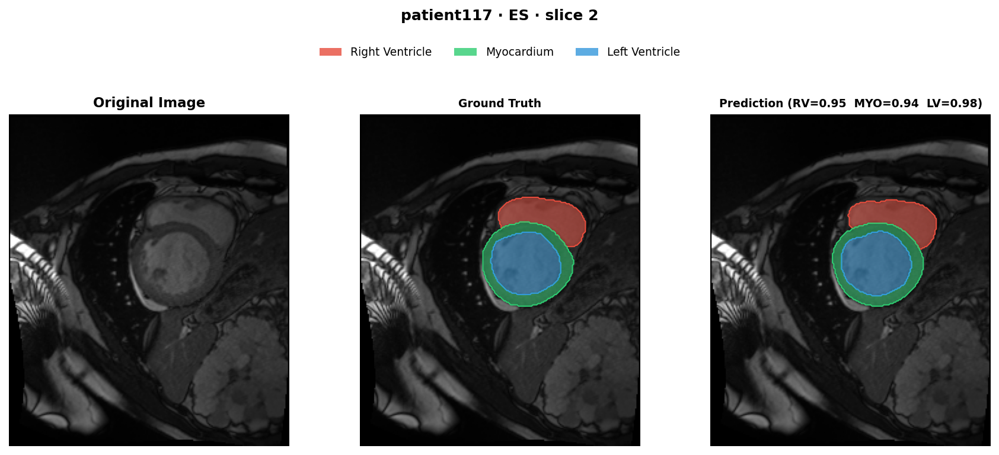
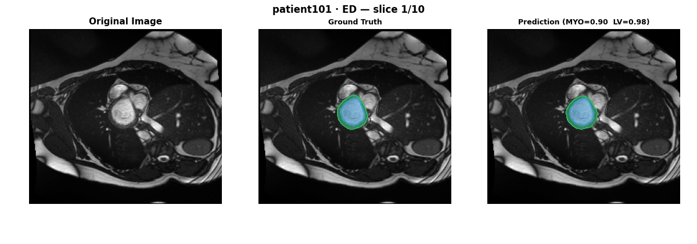
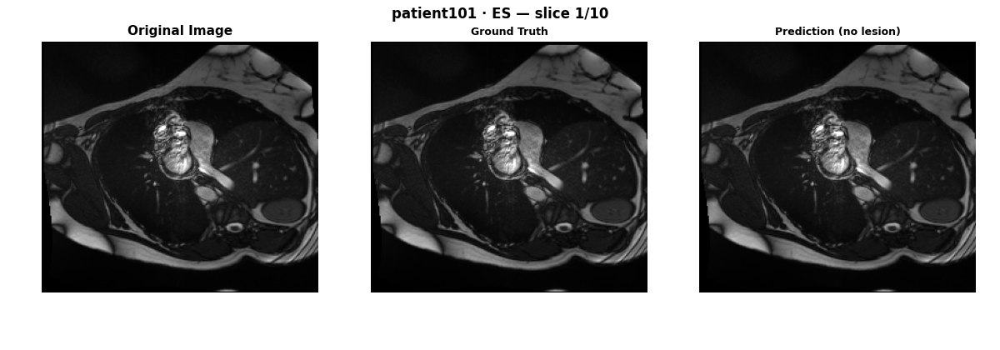
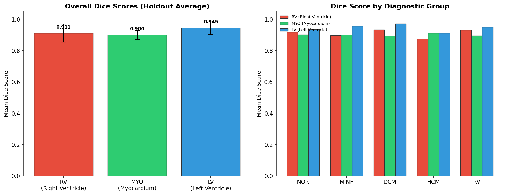
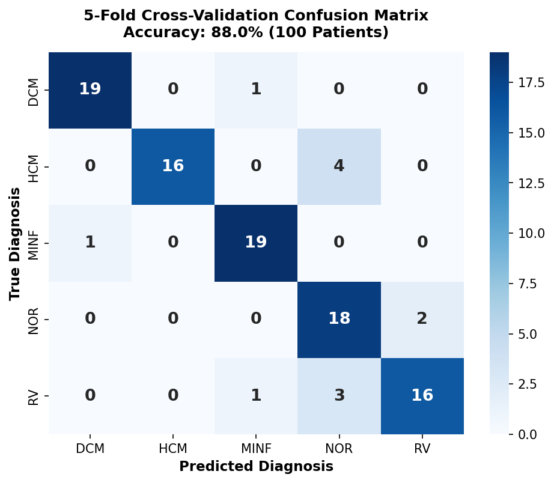

# ACDC Cardiac MRI — 3D Segmentation & Heart Disease Diagnosis

[](https://www.python.org/)
[](https://github.com/MIC-DKFZ/nnUNet)
[](https://drive.google.com/drive/folders/1NN6Qx6nsP55il4r6kfiiKTL7QwS26nWX?usp=sharing)
[](LICENSE)

An end-to-end pipeline that takes short-axis cardiac cine-MRI scans, segments three crucial heart structures in 3D (right ventricle, myocardium, and left ventricle), calculates real-world clinical metrics like ejection fraction and muscle mass, and predicts one of five heart diagnoses.


*Figure 1: Original cine MRI, ground truth annotations, and 3D nnU-Net prediction for patient 117 at end-systole (ES). Red = Right Ventricle (RV), Yellow = Myocardium (MYO), Blue = Left Ventricle (LV).*

<div align="center">
  <h3>End-Diastole (ED) Phase — Full 3D Volumetric Traversal</h3>
  
  <br/><br/>
  <h3>End-Systole (ES) Phase — Full 3D Volumetric Traversal</h3>
  
  <p><em>Figure 2: Animated slice-by-slice volumetric loops (Patient 101) comparing raw cine MRI against expert ground truth and 3D nnU-Net predictions across both End-Diastole and End-Systole cardiac phases.</em></p>
</div>

---

## Results and Metrics

All evaluation numbers below come from testing on holdout patient data using a 3D fullres nnU-Net v2 model (`nnUNetTrainer_250epochs`, fold 0).

### Segmentation Quality (Dice & HD95 Boundary Distance)

All evaluation numbers below come from testing on 50 holdout patients (100 3D volumetric scans across both ED and ES phases):

| Structure | Anatomical Region | Dice Score (Mean ± SD) | HD95 (Mean ± SD) |
| :--- | :--- | :---: | :---: |
| **LV** | Left Ventricle Cavity | **0.945 ± 0.043** | **3.56 ± 6.23 mm** |
| **RV** | Right Ventricle Cavity | **0.911 ± 0.057** | **4.64 ± 3.58 mm** |
| **MYO** | Myocardium Wall | **0.900 ± 0.030** | **2.55 ± 2.30 mm** |
| **OVERALL** | **All 3 Structures** | **0.919** | **3.58 mm** |


*Figure 3: Mean Dice score across all holdout cases.*

The LV cavity achieves high volumetric overlap due to strong blood pool contrast. Crucially, the myocardium wall maintains an exceptionally sharp boundary distance of **2.55 mm HD95**, demonstrating accurate contouring without boundary leakage despite thin-walled anatomy.

### Clinical Metric Accuracy (Ground Truth vs. Predictions)

Instead of just checking whether pixels overlap, we calculate actual clinical biomarkers directly from the predicted masks and compare them to measurements made from expert manual contours:

| Clinical Metric | Mean Absolute Error (MAE) | Pearson Correlation (r) |
| :--- | :---: | :---: |
| **LV Ejection Fraction (%)** | **2.31** | **0.990** |
| **RV Ejection Fraction (%)** | **5.17** | **0.889** |
| **Myocardial Mass (g)** | **7.46** | **0.982** |

An MAE of 2.31% on ejection fraction and a Pearson correlation of 0.990 demonstrates strong agreement with expert-derived clinical measurements.

### Diagnosis Classification Performance

A Random Forest classifier uses 9 clinical volumetric features (ventricular volumes, ejection fractions, mass, and height-indexed values) to classify the patient into one of 5 diagnostic groups.

#### 5-Fold Stratified Cross-Validation (100 Patients, GT Features)

**Overall Accuracy: 0.880 (88.0%)**

<div align="center">
  
  <p><em>Figure 4: Confusion matrix across 5-fold cross-validation (100 patients, 20 per class).</em></p>
</div>

```text
              precision    recall  f1-score   support

         DCM       0.95      0.95      0.95        20
         HCM       1.00      0.80      0.89        20
        MINF       0.90      0.95      0.93        20
         NOR       0.72      0.90      0.80        20
          RV       0.89      0.80      0.84        20

    accuracy                           0.88       100
   macro avg       0.89      0.88      0.88       100
weighted avg       0.89      0.88      0.88       100
```

#### Holdout End-to-End Evaluation (50 Patients, Features from Predicted Masks)

In this setting, zero ground truth is used anywhere: raw MRI $\rightarrow$ 3D predicted mask $\rightarrow$ derived clinical features $\rightarrow$ predicted diagnosis.

**End-to-End Accuracy: 0.860 (86.0%)**

| Pathology Class | Precision | Recall | F1-Score | Support |
| :--- | :---: | :---: | :---: | :---: |
| **DCM** (Dilated Cardiomyopathy) | 0.70 | 0.70 | 0.70 | 10 |
| **HCM** (Hypertrophic Cardiomyopathy) | 1.00 | 0.90 | 0.95 | 10 |
| **MINF** (Myocardial Infarction) | 0.70 | 0.70 | 0.70 | 10 |
| **NOR** (Normal) | 0.91 | 1.00 | 0.95 | 10 |
| **RV** (Abnormal Right Ventricle) | 1.00 | 1.00 | 1.00 | 10 |

---

## What Is This Problem and Why Does It Matter?

When a cardiologist assesses heart health from an MRI, they look at how well the heart pumps blood and whether the muscle walls are unusually thick, thin, or stretched out. 

To measure this accurately, a specialist has to manually draw contours around the heart chambers slice by slice. Doing this by hand for a single patient often takes 20 to 30 minutes of painstaking contouring. If you have dozens of patients a day, it creates a massive clinical bottleneck.

This project automates that entire process:
1. Reads raw cine MRI volumes.
2. Segments the heart chambers and muscle in 3D with high precision.
3. Automatically computes key clinical numbers (ejection fraction, volumes, myocardial mass).
4. Predicts the cardiac diagnosis from those clinical numbers.

### The Data and Cine-MRI Imaging

The dataset comes from the **ACDC (Automated Cardiac Diagnosis Challenge)**:

- **Short-Axis Cine MRI**: Think of this like slicing a loaf of bread from top to bottom. The scanner takes cross-sectional slices through the heart from its base down to the apex. Because the heart is beating, cine MRI records a full loop of the cardiac cycle for each slice.
- **Two Critical Moments (ED and ES)**:
  - **End-Diastole (ED)**: The moment the heart finishes relaxing and fills completely with blood. The ventricles are at their largest volume (EDV).
  - **End-Systole (ES)**: The moment the heart finishes contracting and pumps blood out into the body. The ventricles are at their smallest volume (ESV).
- **The Three Segmented Structures**:
  - **Left Ventricle Cavity (LV)**: The main pump supplying oxygenated blood to the body.
  - **Myocardium (MYO)**: The muscular heart wall surrounding the LV.
  - **Right Ventricle Cavity (RV)**: The thinner, crescent-shaped chamber pumping blood to the lungs.
- **Diagnostic Categories** (100 labeled ACDC patients balanced across five diagnostic categories):
  - **NOR**: Normal healthy heart.
  - **MINF**: Previous myocardial infarction (heart attack damage, reduced pumping power, localized wall thinning).
  - **DCM**: Dilated cardiomyopathy (stretched, enlarged LV chamber with poor ejection fraction).
  - **HCM**: Hypertrophic cardiomyopathy (abnormally thick heart muscle, hyper-contractile).
  - **RV**: Abnormal right ventricle (dilated or dysfunctional RV).

---

## How to Test the Models on Your Own Data (CPU or GPU)

Anyone can test this pipeline directly on their own data. The test script automatically formats your input MRI, runs on your available hardware (CUDA GPU if present, otherwise CPU), extracts clinical metrics, and outputs the predicted diagnosis.

### Download Pre-trained Models

Trained model checkpoints are available on Google Drive:
- **Download Link**: [ACDC Pre-trained Models on Google Drive](https://drive.google.com/drive/folders/1NN6Qx6nsP55il4r6kfiiKTL7QwS26nWX?usp=sharing)

This folder includes:
- `checkpoint_best.pth` and configuration files for the 3D fullres nnU-Net v2 model.
- `cardiac_rf_model.pkl` for the 5-class diagnosis classifier.

### Installation

```bash
git clone https://github.com/Makifkaradag/cardiac-segmentation-diagnosis.git
cd cardiac-segmentation-diagnosis
pip install -r requirements.txt
```

### Run Inference on a Patient

If you have a patient folder containing the ED and ES NIfTI files:

```bash
# Automatically detects GPU or CPU
python test_pipeline.py --patient-dir /path/to/patient_folder --model-dir /path/to/downloaded_weights
```

Or pass individual files directly:

```bash
python test_pipeline.py \
    --ed-image /path/to/patient_ED.nii.gz \
    --es-image /path/to/patient_ES.nii.gz \
    --patient-id patient_sample \
    --model-dir /path/to/downloaded_weights \
    --device cpu \
    --visualize
```

### What You Get in Terminal:

```text
============================================================
  DERIVED CLINICAL METRICS FOR PATIENT_SAMPLE
------------------------------------------------------------
  LV End-Diastolic Volume (EDV) : 142.3 mL
  LV End-Systolic Volume (ESV)  : 61.5 mL
  LV Ejection Fraction (LVEF)   : 56.8 %
  RV End-Diastolic Volume (EDV) : 138.0 mL
  RV End-Systolic Volume (ESV)  : 58.2 mL
  RV Ejection Fraction (RVEF)   : 57.8 %
  Myocardial Mass               : 118.4 g
------------------------------------------------------------

  PREDICTED DIAGNOSIS: NOR
  Clinical Meaning   : Normal cardiac function and morphology

  Class Confidence Probabilities:
    DCM   :   2.1%  [#                             ]
    HCM   :   1.4%  [                              ]
    MINF  :   3.2%  [#                             ]
    NOR   :  88.5%  [##########################    ]
    RV    :   4.8%  [#                             ]
============================================================
```

If `--visualize` is enabled, it also writes a clean PNG overlay showing your raw MRI slice side-by-side with the model's predicted segmentation.

---

## Full Pipeline Training Workflow

If you want to train from scratch on the original ACDC dataset:

1. **Format raw data for nnU-Net**:
   ```bash
   python scripts/prepare_nnunet_data.py --dataset-root ./data/ACDC_database
   ```
2. **Preprocess and train with nnU-Net v2**:
   ```bash
   export nnUNet_raw="./data/nnUNet_raw"
   export nnUNet_preprocessed="./data/nnUNet_preprocessed"
   export nnUNet_results="./data/nnUNet_results"

   nnUNetv2_plan_and_preprocess -d 4 --verify_dataset_integrity
   nnUNetv2_train 4 3d_fullres 0 -tr nnUNetTrainer_250epochs
   ```
3. **Train diagnosis classifier (5-Fold CV)**:
   ```bash
   python scripts/train_classifier.py --dataset-root ./data/ACDC_database
   ```

---

## Citation

```bibtex
@article{bernard2018acdc,
  title   = {Deep learning techniques for automatic MRI cardiac multi-structures segmentation and diagnosis: is the problem solved?},
  author  = {Bernard, Olivier and Lalande, Alain and Zotti, Clement and Cervenansky, Frederick and others},
  journal = {IEEE Transactions on Medical Imaging},
  volume  = {37},
  number  = {11},
  pages   = {2514--2525},
  year    = {2018},
  doi     = {10.1109/TMI.2018.2837502}
}

@article{isensee2021nnunet,
  title   = {nnU-Net: a self-configuring method for deep learning-based biomedical image segmentation},
  author  = {Isensee, Fabian and Jaeger, Paul F. and Kohl, Simon A. A. and Petersen, Jens and Maier-Hein, Klaus H.},
  journal = {Nature Methods},
  volume  = {18},
  number  = {2},
  pages   = {203--211},
  year    = {2021}
}
```

## License

This codebase is licensed under the [MIT License](LICENSE). The ACDC dataset itself is distributed by the original challenge organizers under their official terms.
